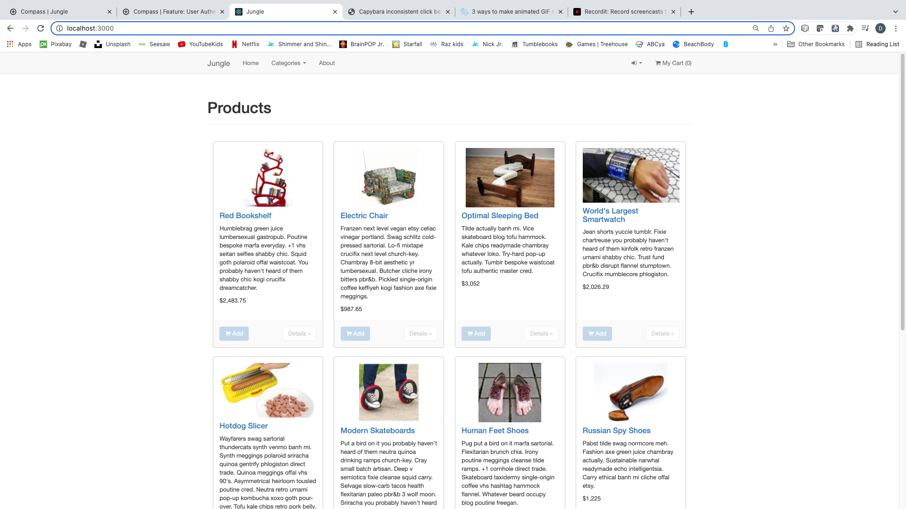
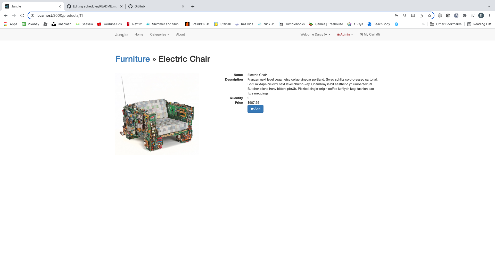
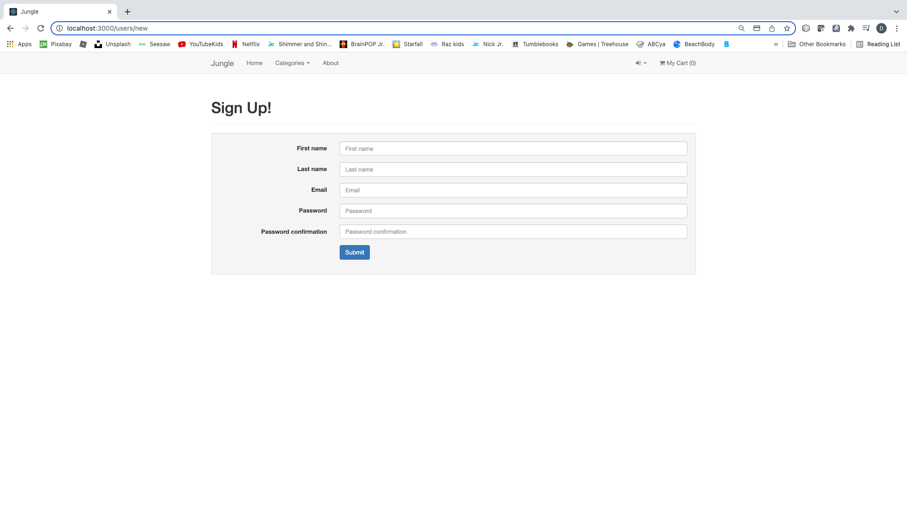
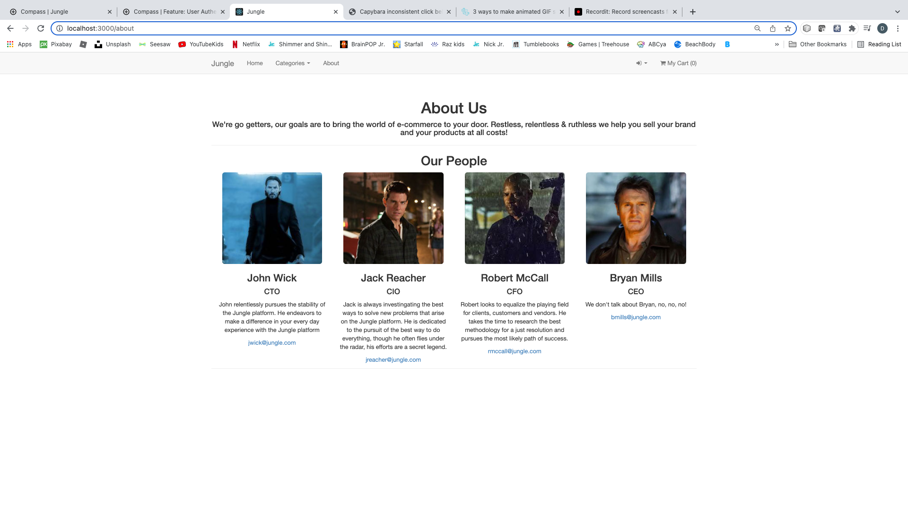
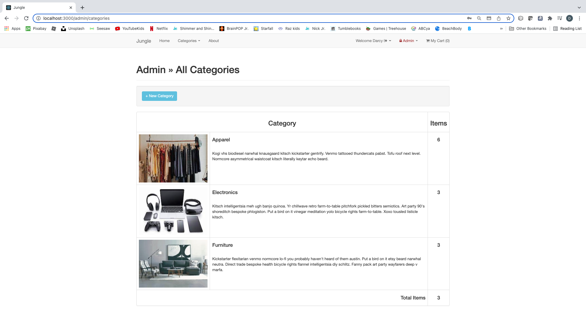
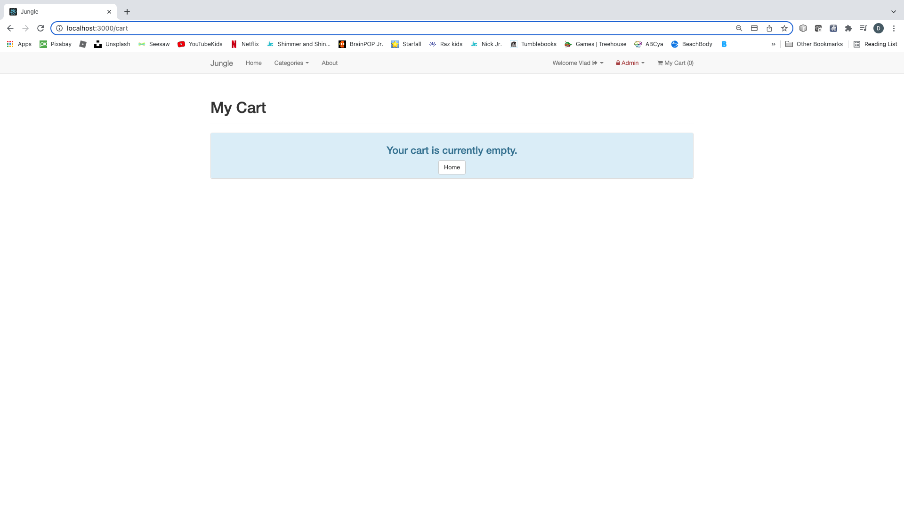
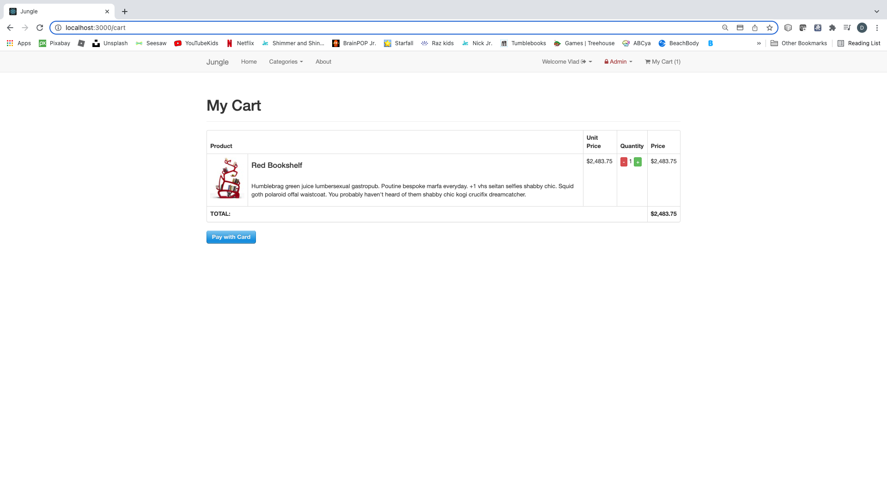

# Jungle

A mini e-commerce application built with Rails 4.2 running Ruby 2.6.6 for purposes of teaching Rails by example.  Testing done with Rspec.

## Additional Steps for Apple M1 Machines

1. Make sure that you are runnning Ruby 2.6.6 (`ruby -v`)
1. Install ImageMagick `brew install imagemagick imagemagick@6 --build-from-source`

## Setup

1. Run `bundle install` to install dependencies
2. Create `config/database.yml` by copying `config/database.example.yml`
3. Create `config/secrets.yml` by copying `config/secrets.example.yml`
4. Run `bin/rake db:reset` to create, load and seed db
5. Create .env file based on .env.example
6. Sign up for a Stripe account
7. Put Stripe (test) keys into appropriate .env vars
8. Run `bin/rails s -b 0.0.0.0` to start the server

## Stripe Testing

Use Credit Card # 4242 4242 4242 4242 with any future date and 3 digit CVV

More information in their docs: <https://stripe.com/docs/testing#cards>

## Dependencies

* Rails 4.2 [Rails Guide](http://guides.rubyonrails.org/v4.2/)
* PostgreSQL 9.x
* Stripe
* Rspec
* Capybara
* Poltergeist
* Clean Database
* BCrypt

## Screenshots

